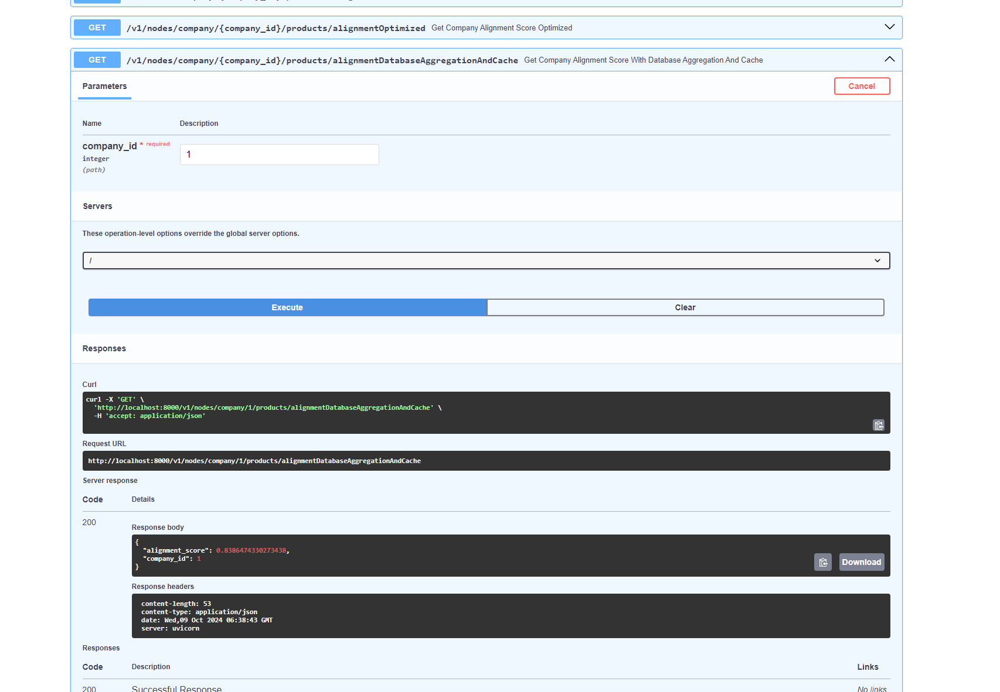

# Installation and running the program

The following code was run on Ubuntu 20.04 with on wsl 2 with docker.

Logic wise all the relevant stuff is contained in the file path `backend/app/routers/v1/nodes_v1.py`
where there existing RESTful endpoint for creating companies, 1-X categories under companies and products
under categories. There are also 3 endpoints for calculating alignment which are described below.

Run the project with

```
docker-compose up --build

(if docker does not work with sudo do the following)
sudo usermod -aG docker current_user
```

View OpenAPI docs at

http://localhost:8000/docs


Then run the following "alignment optimization" endpoints via docs

unoptimized baseline
http://localhost:8000/v1/nodes/company/1/products/alignment

added company id to each product for effective querying
http://localhost:8000/v1/nodes/company/1/products/alignmentOptimized

do the querying directly in the database and cache all results
http://localhost:8000/v1/nodes/company/1/products/alignmentDatabaseAggregationAndCache

or via curl

curl -X 'GET' \
  'http://localhost:8000/v1/nodes/company/1/products/alignment' \
  -H 'accept: application/json'





## Dev time notes

Dev time type hinting

```
python3 -m venv venv
source venv/bin/activate
pip3 install -r requirements.txt
```

migrations

```
you have to build before creating a new migration

docker-compose build
docker-compose run web alembic init migrations
docker-compose build
docker-compose run web alembic revision --autogenerate -m "tree structure"


docker-compose exec db psql -U fastapi_user -d fastapi_db
SELECT * FROM alembic_version;
UPDATE alembic_version SET version_num = 'd370853b3e4b';


DROP SCHEMA public CASCADE;
CREATE SCHEMA public;


sudo chmod -R 777 backend
```
